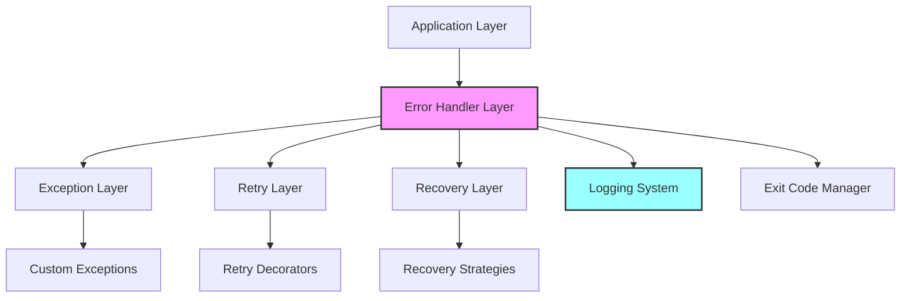
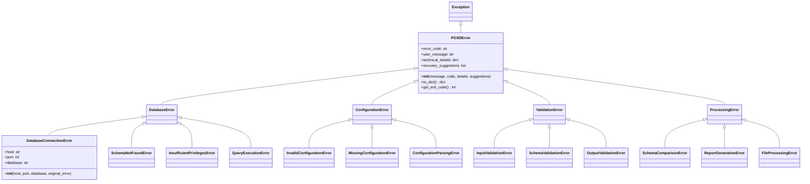

# エラーハンドリングアーキテクチャ設計書

## 1. 概要

PostgreSQL Schema Diff Tool (PGSD)の包括的なエラーハンドリングシステムのアーキテクチャ設計を定義する。

## 2. 設計方針

### 2.1 基本方針
- **ユーザビリティ**: 分かりやすいエラーメッセージの提供
- **保守性**: 一貫性のあるエラー処理パターン
- **拡張性**: 新しいエラータイプの容易な追加
- **可観測性**: 適切なログ記録とエラー追跡
- **回復性**: 可能な場合の自動復旧機能

### 2.2 技術方針
- **例外駆動**: Pythonの例外機構を活用
- **階層化**: 論理的な例外クラス階層
- **構造化**: エラー情報の構造化記録
- **国際化対応**: 英語でのエラーメッセージ
- **テスタビリティ**: エラーシナリオのテスト可能性

## 3. アーキテクチャ構成

### 3.1 システム全体構成



### 3.2 例外クラス階層



## 4. 詳細設計

### 4.1 例外クラス設計

#### 基底例外クラス
```python
class PGSDError(Exception):
    """PGSD application base exception."""
    
    def __init__(
        self,
        message: str,
        error_code: str = None,
        technical_details: Dict[str, Any] = None,
        recovery_suggestions: List[str] = None,
        original_error: Exception = None
    ):
        super().__init__(message)
        self.message = message
        self.error_code = error_code or self._get_default_error_code()
        self.technical_details = technical_details or {}
        self.recovery_suggestions = recovery_suggestions or []
        self.original_error = original_error
        self.timestamp = datetime.utcnow()
        
    def to_dict(self) -> Dict[str, Any]:
        """Convert exception to dictionary for structured logging."""
        return {
            "error_type": self.__class__.__name__,
            "error_code": self.error_code,
            "message": self.message,
            "technical_details": self.technical_details,
            "recovery_suggestions": self.recovery_suggestions,
            "timestamp": self.timestamp.isoformat(),
            "original_error": str(self.original_error) if self.original_error else None
        }
    
    def get_exit_code(self) -> int:
        """Get appropriate exit code for this error."""
        return EXIT_CODES.get(self.__class__.__name__, 1)
```

#### 具体的例外クラス
```python
class DatabaseConnectionError(DatabaseError):
    """Database connection failure."""
    
    def __init__(self, host: str, port: int, database: str, original_error: Exception = None):
        message = f"Failed to connect to database {database} at {host}:{port}"
        technical_details = {
            "host": host,
            "port": port,
            "database": database,
            "connection_type": "postgresql"
        }
        recovery_suggestions = [
            "Check database server is running",
            "Verify connection parameters",
            "Check network connectivity",
            "Validate credentials"
        ]
        super().__init__(
            message=message,
            error_code="DB_CONNECTION_FAILED",
            technical_details=technical_details,
            recovery_suggestions=recovery_suggestions,
            original_error=original_error
        )
```

### 4.2 エラーハンドラー設計

```python
class ErrorHandler:
    """Central error handling and processing."""
    
    def __init__(self, logger: Logger, config: Dict[str, Any]):
        self.logger = logger
        self.config = config
        self.error_reporters = []
        
    def handle_error(
        self,
        error: Exception,
        context: Dict[str, Any] = None,
        reraise: bool = False
    ) -> Optional[Any]:
        """Handle any error with appropriate processing."""
        
        # Convert to PGSD error if needed
        pgsd_error = self._convert_to_pgsd_error(error)
        
        # Log the error
        self._log_error(pgsd_error, context)
        
        # Report the error
        self._report_error(pgsd_error, context)
        
        # Attempt recovery if possible
        recovery_result = self._attempt_recovery(pgsd_error, context)
        
        if recovery_result.recovered:
            return recovery_result.result
        
        if reraise:
            raise pgsd_error
        
        return None
    
    def _convert_to_pgsd_error(self, error: Exception) -> PGSDError:
        """Convert standard exceptions to PGSD exceptions."""
        if isinstance(error, PGSDError):
            return error
        
        # Map common exceptions
        if isinstance(error, psycopg2.OperationalError):
            return DatabaseConnectionError.from_psycopg2_error(error)
        elif isinstance(error, FileNotFoundError):
            return ConfigurationError(
                f"Configuration file not found: {error.filename}",
                error_code="CONFIG_FILE_NOT_FOUND"
            )
        else:
            return PGSDError(
                f"Unexpected error: {str(error)}",
                error_code="UNEXPECTED_ERROR",
                original_error=error
            )
```

### 4.3 リトライ機構設計

```python
class RetryConfig:
    """Retry configuration."""
    
    def __init__(
        self,
        max_attempts: int = 3,
        base_delay: float = 1.0,
        max_delay: float = 60.0,
        backoff_factor: float = 2.0,
        jitter: bool = True,
        retriable_exceptions: Tuple[Type[Exception], ...] = None
    ):
        self.max_attempts = max_attempts
        self.base_delay = base_delay
        self.max_delay = max_delay
        self.backoff_factor = backoff_factor
        self.jitter = jitter
        self.retriable_exceptions = retriable_exceptions or (
            DatabaseConnectionError,
            QueryExecutionError,
        )

def retry_on_error(
    config: RetryConfig = None,
    logger: Logger = None
):
    """Decorator for retrying operations on specific errors."""
    
    def decorator(func):
        @wraps(func)
        def wrapper(*args, **kwargs):
            retry_config = config or RetryConfig()
            attempt = 0
            
            while attempt < retry_config.max_attempts:
                try:
                    return func(*args, **kwargs)
                except Exception as e:
                    attempt += 1
                    
                    if not isinstance(e, retry_config.retriable_exceptions):
                        raise
                    
                    if attempt >= retry_config.max_attempts:
                        raise
                    
                    delay = min(
                        retry_config.base_delay * (retry_config.backoff_factor ** (attempt - 1)),
                        retry_config.max_delay
                    )
                    
                    if retry_config.jitter:
                        delay *= (0.5 + random.random() * 0.5)
                    
                    if logger:
                        logger.warning(
                            "retry_attempt",
                            attempt=attempt,
                            max_attempts=retry_config.max_attempts,
                            delay=delay,
                            error=str(e)
                        )
                    
                    time.sleep(delay)
            
        return wrapper
    return decorator
```

### 4.4 終了コード管理

```python
class ExitCodes:
    """Application exit codes."""
    
    SUCCESS = 0
    GENERAL_ERROR = 1
    INVALID_USAGE = 2
    DATABASE_ERROR = 10
    CONFIGURATION_ERROR = 20
    VALIDATION_ERROR = 30
    PROCESSING_ERROR = 40
    PERMISSION_ERROR = 50
    NETWORK_ERROR = 60
    
    @classmethod
    def get_code_for_exception(cls, exception: Exception) -> int:
        """Get appropriate exit code for exception type."""
        mapping = {
            DatabaseError: cls.DATABASE_ERROR,
            ConfigurationError: cls.CONFIGURATION_ERROR,
            ValidationError: cls.VALIDATION_ERROR,
            ProcessingError: cls.PROCESSING_ERROR,
            InsufficientPrivilegesError: cls.PERMISSION_ERROR,
        }
        
        for exc_type, code in mapping.items():
            if isinstance(exception, exc_type):
                return code
        
        return cls.GENERAL_ERROR
```

## 5. エラーレポート機構

### 5.1 エラーレポート構造

```python
@dataclass
class ErrorReport:
    """Structured error report."""
    
    id: str
    timestamp: datetime
    error_type: str
    error_code: str
    message: str
    technical_details: Dict[str, Any]
    context: Dict[str, Any]
    stack_trace: str
    recovery_attempts: List[Dict[str, Any]]
    user_environment: Dict[str, Any]
    
    def to_dict(self) -> Dict[str, Any]:
        """Convert to dictionary for serialization."""
        return asdict(self)
    
    def to_json(self) -> str:
        """Convert to JSON string."""
        return json.dumps(self.to_dict(), default=str, indent=2)
```

### 5.2 エラーレポーター

```python
class ErrorReporter:
    """Error reporting interface."""
    
    def report(self, error_report: ErrorReport) -> bool:
        """Report error. Returns True if successful."""
        raise NotImplementedError

class FileErrorReporter(ErrorReporter):
    """File-based error reporter."""
    
    def __init__(self, error_log_path: Path):
        self.error_log_path = error_log_path
    
    def report(self, error_report: ErrorReport) -> bool:
        try:
            with open(self.error_log_path, "a") as f:
                f.write(error_report.to_json() + "\n")
            return True
        except Exception:
            return False

class ConsoleErrorReporter(ErrorReporter):
    """Console-based error reporter."""
    
    def report(self, error_report: ErrorReport) -> bool:
        try:
            print(f"ERROR: {error_report.message}", file=sys.stderr)
            if error_report.recovery_attempts:
                print("Recovery suggestions:", file=sys.stderr)
                for suggestion in error_report.recovery_attempts:
                    print(f"  - {suggestion}", file=sys.stderr)
            return True
        except Exception:
            return False
```

## 6. 統合設計

### 6.1 アプリケーション統合

```python
class PGSDApplication:
    """Main application with integrated error handling."""
    
    def __init__(self):
        self.error_handler = ErrorHandler(get_logger(__name__), self.config)
        self.setup_error_handling()
    
    def setup_error_handling(self):
        """Setup global error handling."""
        
        # Set up exception hook
        sys.excepthook = self._handle_uncaught_exception
        
        # Setup signal handlers for graceful shutdown
        signal.signal(signal.SIGINT, self._handle_signal)
        signal.signal(signal.SIGTERM, self._handle_signal)
    
    def _handle_uncaught_exception(self, exc_type, exc_value, exc_traceback):
        """Handle uncaught exceptions."""
        if issubclass(exc_type, KeyboardInterrupt):
            sys.__excepthook__(exc_type, exc_value, exc_traceback)
            return
        
        error = exc_value if isinstance(exc_value, PGSDError) else PGSDError(
            f"Uncaught exception: {exc_value}",
            error_code="UNCAUGHT_EXCEPTION",
            original_error=exc_value
        )
        
        self.error_handler.handle_error(error)
        sys.exit(error.get_exit_code())
    
    def _handle_signal(self, signum, frame):
        """Handle system signals for graceful shutdown."""
        signal_names = {signal.SIGINT: "SIGINT", signal.SIGTERM: "SIGTERM"}
        signal_name = signal_names.get(signum, f"Signal {signum}")
        
        error = PGSDError(
            f"Application interrupted by {signal_name}",
            error_code="INTERRUPTED"
        )
        
        self.error_handler.handle_error(error)
        sys.exit(130)  # Standard exit code for signal interruption
```

### 6.2 デコレーター統合

```python
def error_boundary(
    reraise: bool = True,
    log_error: bool = True,
    return_value: Any = None
):
    """Error boundary decorator for functions."""
    
    def decorator(func):
        @wraps(func)
        def wrapper(*args, **kwargs):
            try:
                return func(*args, **kwargs)
            except Exception as e:
                if log_error:
                    logger = get_logger(func.__module__)
                    logger.error(f"Error in {func.__name__}: {e}")
                
                if reraise:
                    raise
                
                return return_value
        
        return wrapper
    return decorator
```

## 7. 設定管理

### 7.1 エラーハンドリング設定

```yaml
error_handling:
  # Logging configuration
  log_errors: true
  log_level: ERROR
  error_log_file: logs/errors.log
  
  # Retry configuration
  default_retry:
    max_attempts: 3
    base_delay: 1.0
    max_delay: 60.0
    backoff_factor: 2.0
    jitter: true
  
  # Database retry configuration
  database_retry:
    max_attempts: 5
    base_delay: 2.0
    max_delay: 30.0
  
  # Error reporting
  reporters:
    - type: file
      config:
        path: logs/error_reports.jsonl
    - type: console
      config:
        include_stack_trace: false
  
  # Recovery strategies
  auto_recovery: true
  recovery_timeout: 30.0
```

## 8. パフォーマンス考慮事項

### 8.1 エラーハンドリングオーバーヘッド
- **例外生成コスト**: 最小限の情報で例外生成
- **ログ記録コスト**: 非同期ログ記録の活用
- **リトライコスト**: 指数バックオフによる負荷制御

### 8.2 メモリ使用量
- **エラー履歴**: 制限付きエラー履歴保持
- **スタックトレース**: 必要な場合のみ保持
- **技術詳細**: 大きなオブジェクトの参照回避

## 9. セキュリティ考慮事項

### 9.1 機密情報保護
- **パスワード**: エラーメッセージから除外
- **接続文字列**: サニタイズ処理
- **内部パス**: 相対パス表示

### 9.2 ログ記録セキュリティ
- **ログローテーション**: 適切なファイルサイズ制限
- **アクセス制御**: ログファイルの適切な権限設定
- **機密情報**: 構造化ログでの機密情報マスキング

## 10. 拡張性設計

### 10.1 新しい例外タイプの追加
- **継承**: 適切な基底クラスからの継承
- **エラーコード**: 一意なエラーコードの割り当て
- **テスト**: 包括的なテストケースの作成

### 10.2 新しいリカバリ戦略
- **インターフェース**: 共通リカバリインターフェース
- **設定**: YAML設定での戦略指定
- **プラグイン**: 動的ロード機構

---

作成日: 2025-07-14