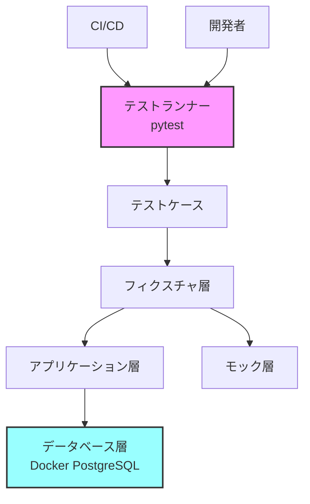

# テスト環境アーキテクチャ設計書

## 1. 概要

PostgreSQL Schema Diff Tool (PGSD)のテスト環境アーキテクチャ設計を定義する。

## 2. 設計方針

### 2.1 基本方針
- **テスト駆動開発（TDD）**: テストファーストで品質を担保
- **マルチバージョン対応**: PostgreSQL 13-16をサポート
- **自動化**: CI/CDパイプラインとの完全統合
- **高速実行**: 並列実行とキャッシュ活用
- **保守性**: 明確な構造と再利用可能なフィクスチャ

### 2.2 技術選定
- **テストフレームワーク**: pytest
  - 豊富なプラグインエコシステム
  - 直感的なフィクスチャ機構
  - 優れた並列実行サポート
- **コンテナ**: Docker Compose
  - 複数PostgreSQL環境の管理
  - ローカル・CI環境の統一
- **カバレッジ**: pytest-cov
  - コードカバレッジ測定・レポート

## 3. アーキテクチャ構成

### 3.1 ディレクトリ構造
```
pgsd/
├── tests/
│   ├── __init__.py
│   ├── conftest.py              # 共通フィクスチャ定義
│   ├── unit/                    # 単体テスト
│   │   ├── __init__.py
│   │   ├── test_*.py
│   │   └── utils/
│   │       └── test_*.py
│   ├── integration/             # 統合テスト
│   │   ├── __init__.py
│   │   ├── test_*.py
│   │   └── database/
│   │       └── test_*.py
│   └── fixtures/                # テストデータ
│       ├── schemas/             # サンプルスキーマ
│       │   ├── simple/
│       │   ├── complex/
│       │   └── edge_cases/
│       └── data/                # テストデータ
├── docker/
│   ├── docker-compose.test.yml  # テスト用Docker環境
│   └── init/                    # DB初期化スクリプト
│       ├── 01_create_schemas.sql
│       └── 02_sample_data.sql
├── pytest.ini                   # pytest設定
├── .coveragerc                  # カバレッジ設定
└── Makefile                     # テストコマンド定義
```

### 3.2 レイヤー構成



## 4. 詳細設計

### 4.1 pytest設定

#### pytest.ini
```ini
[tool:pytest]
testpaths = tests
python_files = test_*.py
python_classes = Test*
python_functions = test_*
addopts = 
    -ra
    --strict-markers
    --cov=src/pgsd
    --cov-report=term-missing
    --cov-report=html
    --cov-report=xml
markers =
    unit: Unit tests
    integration: Integration tests
    slow: Slow tests
    db: Database tests
```

### 4.2 Docker Compose環境

#### docker-compose.test.yml
```yaml
version: '3.8'

services:
  postgres-13:
    image: postgres:13-alpine
    environment:
      POSTGRES_DB: pgsd_test
      POSTGRES_USER: test_user
      POSTGRES_PASSWORD: test_pass
    ports:
      - "5433:5432"
    volumes:
      - ./docker/init:/docker-entrypoint-initdb.d:ro
    healthcheck:
      test: ["CMD-SHELL", "pg_isready -U test_user"]
      interval: 5s
      timeout: 5s
      retries: 5

  postgres-14:
    image: postgres:14-alpine
    environment:
      POSTGRES_DB: pgsd_test
      POSTGRES_USER: test_user
      POSTGRES_PASSWORD: test_pass
    ports:
      - "5434:5432"
    volumes:
      - ./docker/init:/docker-entrypoint-initdb.d:ro
    healthcheck:
      test: ["CMD-SHELL", "pg_isready -U test_user"]
      interval: 5s
      timeout: 5s
      retries: 5

  postgres-15:
    image: postgres:15-alpine
    environment:
      POSTGRES_DB: pgsd_test
      POSTGRES_USER: test_user
      POSTGRES_PASSWORD: test_pass
    ports:
      - "5435:5432"
    volumes:
      - ./docker/init:/docker-entrypoint-initdb.d:ro
    healthcheck:
      test: ["CMD-SHELL", "pg_isready -U test_user"]
      interval: 5s
      timeout: 5s
      retries: 5

  postgres-16:
    image: postgres:16-alpine
    environment:
      POSTGRES_DB: pgsd_test
      POSTGRES_USER: test_user
      POSTGRES_PASSWORD: test_pass
    ports:
      - "5436:5432"
    volumes:
      - ./docker/init:/docker-entrypoint-initdb.d:ro
    healthcheck:
      test: ["CMD-SHELL", "pg_isready -U test_user"]
      interval: 5s
      timeout: 5s
      retries: 5
```

### 4.3 フィクスチャ設計

#### 共通フィクスチャ（conftest.py）
```python
import pytest
from typing import Generator, Dict, Any
import docker
from pathlib import Path

@pytest.fixture(scope="session")
def docker_client():
    """Docker client fixture"""
    return docker.from_env()

@pytest.fixture(scope="session")
def test_db_config() -> Dict[str, Any]:
    """Test database configuration"""
    return {
        "host": "localhost",
        "database": "pgsd_test",
        "user": "test_user",
        "password": "test_pass",
    }

@pytest.fixture(
    params=[
        {"port": 5433, "version": "13"},
        {"port": 5434, "version": "14"},
        {"port": 5435, "version": "15"},
        {"port": 5436, "version": "16"},
    ],
    ids=["pg13", "pg14", "pg15", "pg16"]
)
def postgres_version(request) -> Dict[str, Any]:
    """Parameterized fixture for multiple PostgreSQL versions"""
    return request.param

@pytest.fixture
def test_schemas_path() -> Path:
    """Path to test schema fixtures"""
    return Path(__file__).parent / "fixtures" / "schemas"
```

### 4.4 テストカテゴリ設計

#### 4.4.1 単体テスト
- **対象**: 個別の関数・クラス
- **モック使用**: 外部依存をモック化
- **実行時間**: < 1秒/テスト
- **並列実行**: 可能

#### 4.4.2 統合テスト
- **対象**: モジュール間連携
- **実DB使用**: Docker PostgreSQL
- **実行時間**: < 10秒/テスト
- **並列実行**: DB別に可能

#### 4.4.3 E2Eテスト
- **対象**: 全体フロー
- **実環境相当**: 本番同等の設定
- **実行時間**: < 60秒/テスト
- **並列実行**: 制限あり

## 5. 実行戦略

### 5.1 ローカル実行
```bash
# 全テスト実行
make test

# 単体テストのみ
make test-unit

# 統合テストのみ
make test-integration

# 特定バージョンのみ
make test-pg15

# カバレッジレポート生成
make coverage
```

### 5.2 CI/CD実行
- **並列戦略**: OS × Python × PostgreSQL
- **キャッシュ**: pip, Docker イメージ
- **失敗時**: 即座に停止

## 6. パフォーマンス最適化

### 6.1 並列実行
- pytest-xdist による並列化
- CPU コア数に応じた自動調整
- DB接続プールの活用

### 6.2 キャッシュ戦略
- Docker レイヤーキャッシュ
- pytest キャッシュ（前回失敗分）
- pip キャッシュ

## 7. 品質基準

### 7.1 カバレッジ目標
- **初期目標**: 40%以上
- **中期目標**: 60%以上
- **最終目標**: 80%以上

### 7.2 実行時間目標
- **単体テスト**: 全体で30秒以内
- **統合テスト**: 全体で3分以内
- **全テスト**: 5分以内

## 8. セキュリティ考慮事項

### 8.1 テストデータ
- 機密情報を含まない
- ダミーデータ使用
- 環境変数での設定管理

### 8.2 アクセス制御
- ローカルホストのみ
- テスト用認証情報
- CI環境でのシークレット管理

## 9. 今後の拡張

### 9.1 追加予定機能
- パフォーマンステスト
- 負荷テスト
- セキュリティテスト
- mutationテスト

### 9.2 ツール統合
- テストレポートダッシュボード
- 自動テスト生成
- ビジュアルリグレッションテスト

---

作成日: 2025-07-14